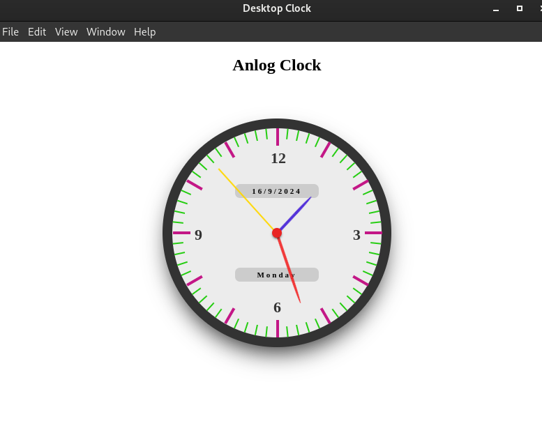

# Electron Clock App

## Overview

This is a simple desktop application built with Electron that displays a clock, Date and Day on your screen. It showcases how to create a basic Electron app and handle fundamental GUI operations.



## Prerequisites:

Before you begin, ensure you have met the following requirements:

- `Node.js:` Ensure Node.js is installed on your system. You can download it from [nodejs.org](https://nodejs.org/).
- `npm: npm (Node Package Manager)` is included with Node.js. You can verify its installation by running `npm --version` in your terminal.

## Getting Started

Follow these steps to set up and run the Electron Clock app on your local machine.

## Clone the Repository

First, clone the repository to your local machine:

```bash
git clone git@github.com:vishalupadhyayrsm/Desktop-Clock-Application.git
cd Desktop-Clock-Application
```

## Install Dependencies

Navigate to the project directory and install the required dependencies:

```bash
npm install

```

## Project Structure

The project directory contains the following files:

- `package.json:` Manages dependencies and scripts for the Electron app.
- `index.js:` The main process file that initializes and manages the Electron app window.
- `index.html:` The HTML file for the app's user interface.
- `clock.js:` The renderer process script that handles the clock's functionality and updates the display.
- `index.css:` Contains the styling for the clock display.

## Understanding the Code

- `index.js:` Initializes the Electron app, creates a window, and loads index.html.

```bash
const { app, BrowserWindow } = require("electron");

function createWindow() {
  const win = new BrowserWindow({
    width: 800,
    height: 600,
    webPreferences: {
      nodeIntegration: true,
    },
  });

  win.loadFile("index.html");
  ### the below line code will open the dev tool for debugging purposes
  ###   win.webContents.openDevTools();
}

app.whenReady().then(() => {
  createWindow();

  app.on("activate", () => {
    if (BrowserWindow.getAllWindows().length === 0) createWindow();
  });
});

app.on("window-all-closed", () => {
  if (process.platform !== "darwin") {
    app.quit();
  }
});

```

- `index.html:` Provides the structure of the app.

```bash
<!DOCTYPE html>
<html lang="en">
  <head>
    <meta charset="UTF-8">
    <title>Hello World!</title>
    <link rel="stylesheet" href="index.css">
  </head>
  <body>
    <h2 class="heading">Anlog Clock</h2>
    <div class="clock">
        <div>
          <div class="info date"></div>
          <div class="info day"></div>
        </div>
        <div class="dot"></div>
        <div>
          <div class="hour-hand"></div>
          <div class="minute-hand"></div>
          <div class="second-hand"></div>
        </div>
        <div>
          <span class="h3">3</span>
          <span class="h6">6</span>
          <span class="h9">9</span>
          <span class="h12">12</span>
        </div>
        <div class="diallines"></div>
      </div>
  </body>
  <script src="clock.js"></script>
</html>
```

## Running the App

To start the Electron app, run:

```bash
npm start
```

This command will launch the application, and you should see a window displaying the current time, Date and Days.

## Building for Distribution

To package your Electron app for distribution, you can use Electron's electron-builder or similar tools. Follow these steps:

- `Install electron-builder:`

```bash
npm install --save-dev electron-builder
```

Add a build script in your package.json:

```bash
"scripts": {
  "build": "electron-builder"
}

```

- Run the build command:

```bash
npm run build

```

# Author

`Vishal Kumar Upadhyay`
